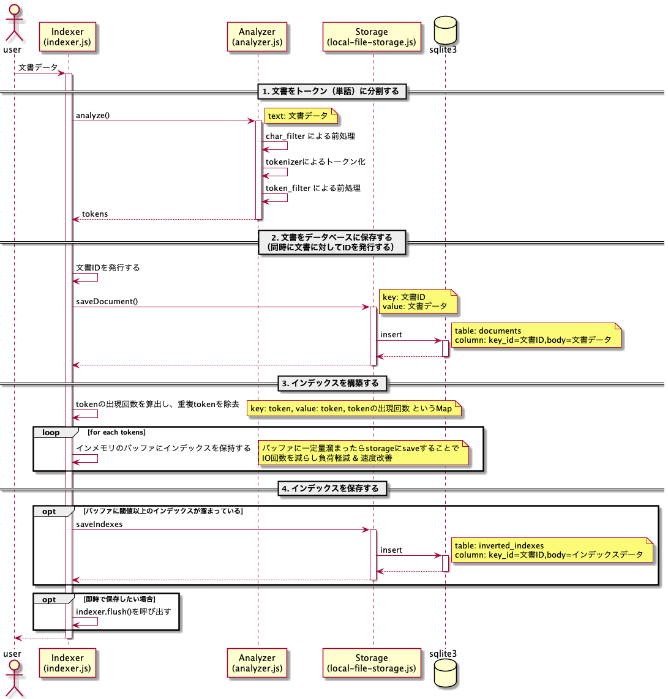
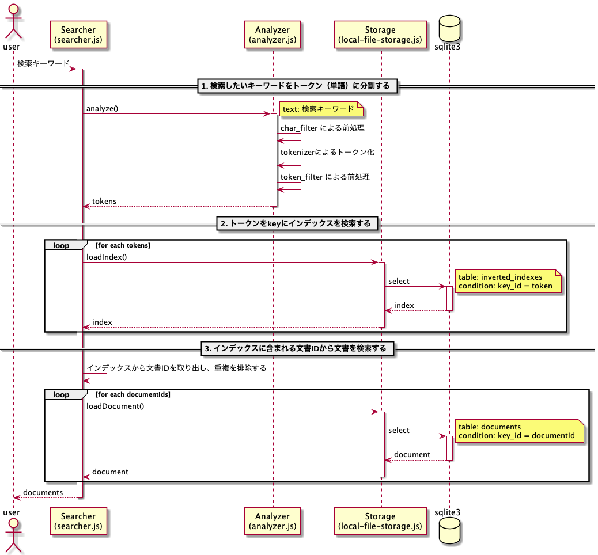

# 概要

## 全文検索について
https://www.notion.so/78044c6dbd8e45d2a367b8989b40f597

## インデックスの流れ


## 検索の流れ


# 開発環境構築

## 事前準備

- node のインストール
  - LTS の `v16.13.0` を利用している
  - バージョン管理方法は任意
    - 本リポジトリは nvm でバージョン管理している
- VSCode のインストール
  - https://azure.microsoft.com/ja-jp/products/visual-studio-code/
  - プラグインは以下を利用している
    - [Prettier](https://marketplace.visualstudio.com/items?itemName=esbenp.prettier-vscode)
      - コードフォーマット
    - [Visual Studio IntelliCode](https://marketplace.visualstudio.com/items?itemName=VisualStudioExptTeam.vscodeintellicode)
      - 補完など
    - [Jest Runner](https://marketplace.visualstudio.com/items?itemName=firsttris.vscode-jest-runner)
      - unit test の実行

## 手順

```shell
npm install
```

## 留意点

- JavaScript の型チェックは [vscode の type-checking](https://code.visualstudio.com/docs/languages/javascript#_type-checking) を利用している
  - ファイルの先頭に `@ts-check` をつけると、JSDoc を元に型チェックやコード補完を行ってくれる

# 性能検証

- 文書データとして Wikipedia のデータを利用する
- 以下と検索性能を比較してみる
  - grep コマンド
  - sqlite に LIKE クエリ

## テストデータ
- 10000件分のテストデータは以下からダウンロード可能
  - https://github.com/ryo-chin/node-js-full-text-search-engine/blob/dump_data/db/dump/wikipedia_dump.txt

それ以上のデータを用意したい場合は後述の手順で行う

## Wikipedia ダンプデータの作成方法

### 事前準備

以下をダウンロード & インストールする

- Wikipedia dump data
  - インデックスデータとして利用する
  - 以下からダウンロードすることができる
    - https://dumps.wikimedia.org/jawiki/latest/
    - `jawiki-latest-pages-articles.xml` に最新の全ての記事データが入っている
      - 2021/11/23 時点では 14GB 程度
- WikiExtractor
  - Wikipedia のダンプデータ内の余分な文字列を取り除いて抽出してくれる Python プラグイン
    - https://github.com/attardi/wikiextractor
  - github から clone して利用する
    ```shell
    git clone https://github.com/attardi/wikiextractor
    ```
  - xml から json に変換することも可能
  - 実行には Python の 3 系が必要
- nkf
  - WikiExtractor が吐き出す [ユニコードエスケープ方式](http://una.soragoto.net/topics/12.html) の文字列を変換する際に利用
    - https://osdn.net/projects/nkf/
  - 以下のコマンドで install する（Mac で brew を使ってる場合）
    ```shell
    brew install nkf
    ```

### 手順

1. Wikipedia の xml データを解凍する
   - WikiExtractor は圧縮されたまま(bz2 形式のまま)でも利用できるらしいので解凍しなくてもいいかも
2. WikiExtractor を実行して任意の場所に整形データを吐き出す
   - 以下は json 形式で 5GB ごとにファイルを出力した時のコマンド
   ```python
   python -m wikiextractor.WikiExtractor ~/Downloads/jawiki-latest-pages-articles.xml --processes 8 -o ~/projects/node-js-full-text-search-engine/db/wikipedia --json -b 5G
   ```
3. 必要な行数分を別ファイルに書き出し（任意）
   - そのままだとデータ量が多すぎて扱いづらい場合は必要分だけ切り出す
   - 1 行 1 ドキュメントで吐き出されているので head コマンドなどで必要行数分を別ファイルに書き出す
   ```shell
    head -n 100000 db/wikipedia/AA/wiki_00 > db/wikipedia/dump/wikipedia_dump_100000.txt
   ```
4. 整形したデータを nkf でデコードする（任意）
   - grep コマンドと比較するために行っているだけなので実行は任意
   ```shell
   cat db/wikipedia/dump/wikipedia_dump_100000.txt | sed 's/\\\u\(....\)/\&#x\1;/g' | nkf --numchar-input -w > db/wikipedia/dump/wikipedia_dump_100000_decoded.tx
   ```
   - 10 万行だと大体 500MB くらいになる
5. インデックスする
   - npm のコマンドで実行
   ```shell
   npm run index -- --inputFilePath ./db/wikipedia/dump/wikipedia_dump_100000.txt --outputFilePath ./db/database.sqlite  --count 10 --parallel 8
   ```

## 性能比較

### 条件

| 項目         | 条件      |
| ------------ | --------- |
| 文書データ数 | 100000 件 |
| 取得数制限   | なし      |

#### grep

```shell
# grep検索にかかった時間を測定したいので -c オプションでヒットした行数(=件数)を出力する
time grep '{キーワード}' -c db/wikipedia/dump/wikipedia_dump_100000.txt

# 例: JavaScript でgrep検索. 4[s]前後かかる
time grep 'JavaScript' -c db/wikipedia/dump/wikipedia_dump_100000.txt
# 62
# grep --color=auto 'JavaScript' -c db/wikipedia/dump/wikipedia_dump_100000.txt  3.85s user 0.07s system 99% cpu 3.927 total
```

#### search engine

```shell
npm run search -- --count {取得件数} --query '{キーワード}'

# 例: JavaScript で全件(=100000件)に対してインデックス検索. 11[ms]前後かかる
npm run search -- --count 100000 --query 'JavaScript'
# ...(検索結果は省略)
# 62件中62件 (11.2[ms])
```

### 結果

| 検索種別         | 時間       |
| ---------------- | ---------- |
| grep 検索        | 約 4[s]    |
| インデックス検索 | 約 0.01[s] |

オーダーで考えるとインデックス検索の方が 100 倍以上早いことになる
